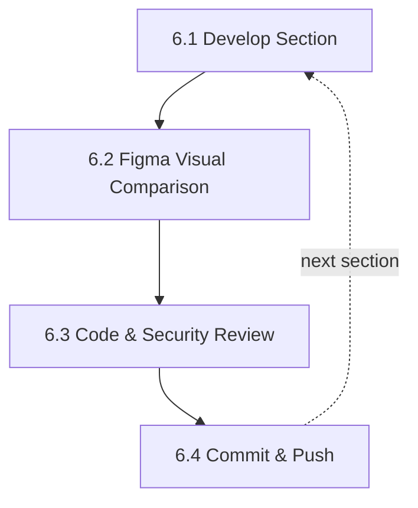

# Standard Operating Procedure: AI-Assisted Figma to WordPress Development

This document outlines the step-by-step workflow for translating Figma designs into production-ready WordPress sites using AI tooling, Model Context Protocol (MCP) integrations, and developer guardrails.

---

## Table of Contents

1. [Stage 1: Local Environment Setup](#stage-1-local-environment-setup)
2. [Stage 2: AI Tooling & MCP Integration](#stage-2-ai-tooling--mcp-integration)
3. [Stage 3: AI Guardrails & Context Rules](#stage-3-ai-guardrails--context-rules)
4. [Stage 4: Figma Design Analysis & Tokenization](#stage-4-figma-design-analysis--tokenization)
5. [Stage 5: Architecture & Development Plan](#stage-5-architecture--development-plan)
6. [Stage 6: Section-by-Section Build Loop](#stage-6-section-by-section-build-loop)
7. [Stage 7: Quality Assurance & Testing](#stage-7-quality-assurance--testing)
8. [Stage 8: Content & SEO Preparation](#stage-8-content--seo-preparation)
9. [Stage 9: Deployment & Client Handoff](#stage-9-deployment--client-handoff)
10. [Stage 10: Production Launch](#stage-10-production-launch)

---

## Stage 1: Local Environment Setup

### 1.1 Local WordPress Setup

- [ ] Spin up local WordPress site (e.g., LocalWP, Lando, or DDEV).
- [ ] Configure environment details:
  - PHP Version: `8.2+`
  - Web Server: NGINX / Apache
  - WP Version: Latest Stable
- [ ] Install base theme framework (Custom Starter / Block Theme) and essential plugin stack.

### 1.2 Version Control Initialization

- [ ] Initialize Git repository in the custom theme or project root:

  ```bash
  git init
  ```

- [ ] Create `.gitignore` (exclude `wp-config.php`, `uploads/`, node modules, vendor files).
- [ ] Set up default branching structure:
  - `main` — Production
  - `staging` — Testing
  - `feature/[section-name]` — Working branches

---

## Stage 2: AI Tooling & MCP Integration

### 2.1 IDE Setup

- [ ] Open local project directory in Claude Code (or configured terminal/IDE environment).
- [ ] Verify root directory context and project permissions.

### 2.2 WordPress MCP Connection

- [ ] Connect WordPress MCP server (e.g., Novamira WP MCP):
  - Configure Application Passwords or API keys in `.env`.
  - Validate CRUD access to posts, custom post types, fields, and options tables.

### 2.3 WordPress Agent Skills

- [ ] Install and verify WordPress agent skills for automated development tasks:
  - Template hierarchy lookup skill.
  - Block registration / ACF field definition skill.
  - Code linting & security validation skill.

### 2.4 Browser & Figma Connectors

- [ ] Connect Claude Chrome extension for active DOM inspecting and visual checking.
- [ ] Connect Claude Figma integration (via MCP / API token) for direct component inspection.

---

## Stage 3: AI Guardrails & Context Rules

### 3.1 Create `CLAUDE.md` Project Rules

- [ ] Create a `CLAUDE.md` file in the project root to enforce coding standards, directory conventions, and security guidelines:

  ```markdown
  # Project Guardrails & Rules

  ## WordPress & PHP Standards
  - Follow WordPress Coding Standards (WPCS).
  - Always sanitize inputs (`sanitize_text_field`, etc.) and escape outputs (`esc_html`, `esc_attr`, `esc_url`).
  - Use strict typing where applicable (`declare(strict_types=1);`).
  - Do not edit core files or third-party plugin source code directly.

  ## Architecture Guidelines
  - Keep logic separate from presentation (utilize render templates or controllers).
  - Use `theme.json` or standard CSS variables for styling consistency.
  - Avoid inline styles; utilize utility classes or styled CSS components.

  ## AI Assistant Behavior
  - Execute edits incrementally, section by section.
  - Run syntax and lint checks prior to marking tasks as complete.
  - Prompt for human confirmation before running database-altering commands or destructive file operations.
  ```

---

## Stage 4: Figma Design Analysis & Tokenization

### 4.1 Permissions & Seat Audit

- [ ] Open target Figma file and verify user seat type:
  - **Free / Collab Seat**
    - Rely on manual visual comparison and exported assets.
    - Utilize Dev Mode screenshots and standard Inspect CSS panel.
  - **Dev / Full Seat**
    - Enable full Figma MCP context integration.
    - Direct access to design tokens, auto-layout constraints, and Figma variable trees.

### 4.2 Design System & Token Extraction

- [ ] Extract and document design tokens:
  - **Color Palette:** Primary, Secondary, Neutral, State colors (hover, focus, disabled).
  - **Typography:** Font families, weight scales, font-size clamps (`clamp()`), line heights, letter spacing.
  - **Spacing System:** Base unit grid (e.g., 4px/8px system), container max-widths, section padding.
  - **Elevation & Effects:** Box shadows, border radius values, backdrop blurs.
- [ ] Compile tokens into a design guide or configuration file (e.g., `theme.json`, Tailwind config, or CSS variables file).

### 4.3 Breakpoint Definition

- [ ] Confirm layout breakpoints based on Figma frames:

  | Breakpoint | Range |
  |---|---|
  | Mobile | `375px` – `639px` |
  | Tablet | `640px` – `1023px` |
  | Desktop / Laptop | `1024px` – `1439px` |
  | Wide Desktop | `1440px+` |

---

## Stage 5: Architecture & Development Plan

### 5.1 Global Layout Components

- [ ] Map out global reusable components:
  - Header & sticky/transparent variants.
  - Main navigation & mobile off-canvas drawer.
  - Footer & widget areas.
  - Reusable banners, modals, and CTA bars.

### 5.2 Content Model & Field Architecture

- [ ] Define Custom Post Types (CPTs) and Taxonomies.
- [ ] Plan ACF / Native Meta Field mapping:
  - Map Figma dynamic UI elements to explicit field keys.
  - Choose layout formats (Flex Field / Gutenberg Block / Custom Repeater).

### 5.3 Section-Wise Execution Plan

- [ ] Enter AI Plan Mode to draft a step-by-step roadmap:
  - Break down pages into distinct modular sections.
  - Assign explicit priorities and dependency requirements for each section.

---

## Stage 6: Section-by-Section Build Loop

Iterate through steps 6.1 – 6.4 for every page section.



### 6.1 Develop Section

- [ ] Write markup (PHP/HTML), styles (CSS/Tailwind), and behavior (JS).
- [ ] Bind custom fields/ACF variables to dynamic templates.

### 6.2 Visual Diff vs. Figma

- [ ] Compare local frontend against Figma reference:
  - Verify typography scaling, spacing/padding, alignment, and hover interactions.
  - Test across desktop, tablet, and mobile viewports.

### 6.3 Frontend & Backend Review

- [ ] **Frontend check:** Validate HTML semantic structure, responsiveness, and console errors.
- [ ] **Backend check:** Verify ACF field readability, Gutenberg block editor preview render, and query performance.

### 6.4 Commit Work

- [ ] Commit section work with a descriptive message:

  ```bash
  git add .
  git commit -m "feat(hero-section): implement hero banner with dynamic ACF fields"
  ```

---

## Stage 7: Quality Assurance & Testing

### 7.1 Cross-Device & Responsive Testing

- [ ] Test on real devices and screen dimensions (`320px` to `2560px`).
- [ ] Validate touch targets and hover states on mobile/tablet.

### 7.2 Accessibility (a11y)

- [ ] Ensure correct heading hierarchy (`H1` through `H6`).
- [ ] Check color contrast compliance (WCAG AA minimum).
- [ ] Verify full keyboard navigation and screen reader compatibility (`aria-*` tags).

### 7.3 Performance & Core Web Vitals

- [ ] Run Lighthouse / PageSpeed Insights audits:
  - Target LCP (Largest Contentful Paint) < 2.5s.
  - Target CLS (Cumulative Layout Shift) < 0.1.
- [ ] Optimize images (WebP/AVIF format, proper `srcset` and lazy loading).

### 7.4 Cross-Browser Compatibility

- [ ] Verify consistency on Chrome, Safari, Firefox, and Edge.

---

## Stage 8: Content & SEO Preparation

### 8.1 Real Content Ingestion

- [ ] Replace placeholder text/lorem ipsum with final production copy.
- [ ] Upload optimized media assets with complete `alt` text descriptions.

### 8.2 On-Page SEO Basics

- [ ] Configure page titles, meta descriptions, and OpenGraph social preview tags.
- [ ] Set up XML sitemaps and dynamic canonical URLs.
- [ ] Implement Schema.org structured data (Organization, WebPage, Article, etc.).

---

## Stage 9: Deployment & Client Handoff

### 9.1 Staging Deployment

- [ ] Deploy local environment to public staging server.
- [ ] Migrate database and replace local URLs with staging URLs.
- [ ] Verify SSL configuration and server environment settings.

### 9.2 Client Review & Design Sign-off

- [ ] Perform final visual diff check against Figma on staging.
- [ ] Gather client feedback and execute micro-revisions.
- [ ] Receive formal visual and functional sign-off.

---

## Stage 10: Production Launch

### 10.1 Pre-Launch Checklist

- [ ] Backup existing production site (if applicable).
- [ ] Disable search engine visibility blocking ("Discourage search engines from indexing").
- [ ] Configure production caching (Redis, WP Rocket, Object Caching) and CDN.

### 10.2 Go-Live

- [ ] Migrate database/files to production server or execute DNS switch.
- [ ] Perform search-and-replace on staging/local domain strings to production domain.
- [ ] Re-generate SSL certificate and verify HTTPS redirects.

### 10.3 Post-Launch Audit

- [ ] Test critical conversion paths (contact forms, checkout flows, downloads).
- [ ] Submit sitemap to Google Search Console.
- [ ] Confirm analytics and tracking scripts are firing correctly.
